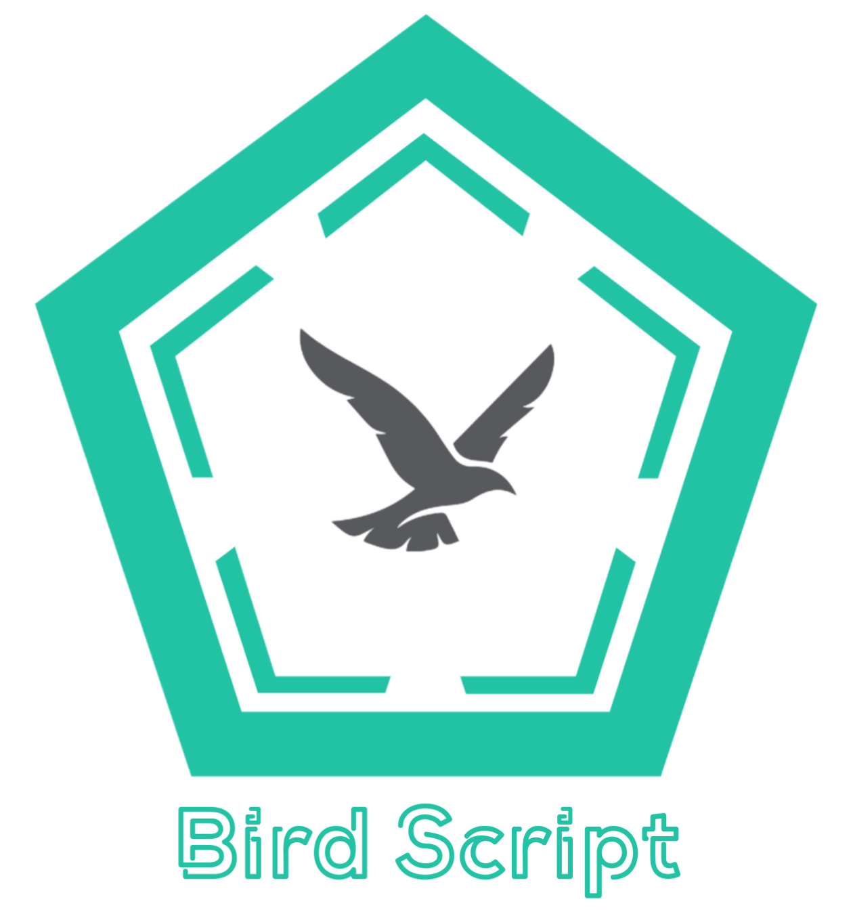

<div align="center">
0.0.2 alpha - Not Stable


<h3>Interpreted, Object oriented programming language.</h3></div>

# File Format
#### [may vary according to version changes]
```
Bird Script --root
├──  Specs
│	 └── spec.json
│		core.spec
│	  	init.spec
│		dataSpec.pyc	
│		cofig.pyc
│
├──  DataKey
│         └── DataKey.pyc
│		  DataTkn.ocx  
│
├──  Constants
│		└── constants.pyc	
│
├──  Includes
│		└── guiMaker.pyc
│
├──  Strings
│	  └── strings.pyc
│		 positions.pyc
│
├── Bin
│	└──  main.pyc
│	        birdscript.pyc
│    	        shell.pyc
│		pycerx.pyc
│		bspy.pyc
│		jbirdscript.pyc
│		cbs.pyc
│		birdscript.py/*4
│		birdscript_shell.py
│		select.pdb
│		select.pyd
│		select_d.pdb
│		select_d.pyd
│		sqlite3.dll
│		sqlite3.pdb
│		sqlite3_d.dll
│		sqlite3_d.pdb
│		tcl86t.dll
│		tk86t.dll
│		unicodedata.pdb
│		unicodedata.pyd
│		unicodedata_d.pdb
│		unicodedata_d.pyd
│		winsound.pdb
│     
├──  DLLs
│	└── _asyncio.pdb
│	_asyncio.pyd
│	_asyncio_d.pdb
│	_asyncio_d.pyd
│	_bz2.pdb
│	_bz2.pyd
│	_bz2_d.pdb
│	_bz2_d.pyd
│	_ctypes.pdb
│	_ctypes.pyd
│	_ctypes_d.pdb
│	_ctypes_d.pyd
│	_ctypes_test.pdb
│	_ctypes_test.pyd
│	_ctypes_test_d.pdb
│	_ctypes_test_d.pyd
│	_decimal.pdb
│	_decimal.pyd
│	_decimal_d.pdb
│	_decimal_d.pyd
│	_elementtree.pdb
│	_elementtree.pyd
│	_elementtree_d.pdb
│	_elementtree_d.pyd
│	_hashlib.pdb
│	_hashlib.pyd
│	_hashlib_d.pdb
│	_hashlib_d.pyd
│	_lzma.pdb
│	_lzma.pyd
│	_lzma_d.pdb
│	_lzma_d.pyd
│	_msi.pdb
│
├── Documentation.txt
│
├── README.md
│
├── ProjectSetup-BirdScript.exe
│
└──  buid.spec
```


